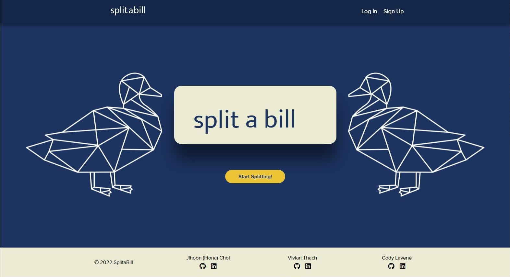
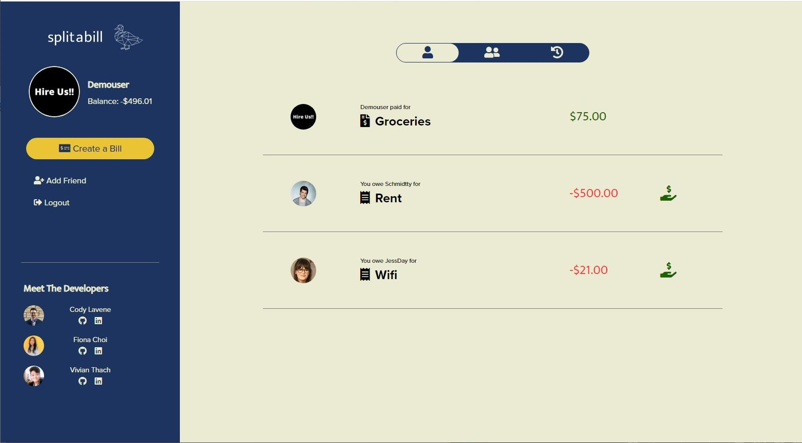
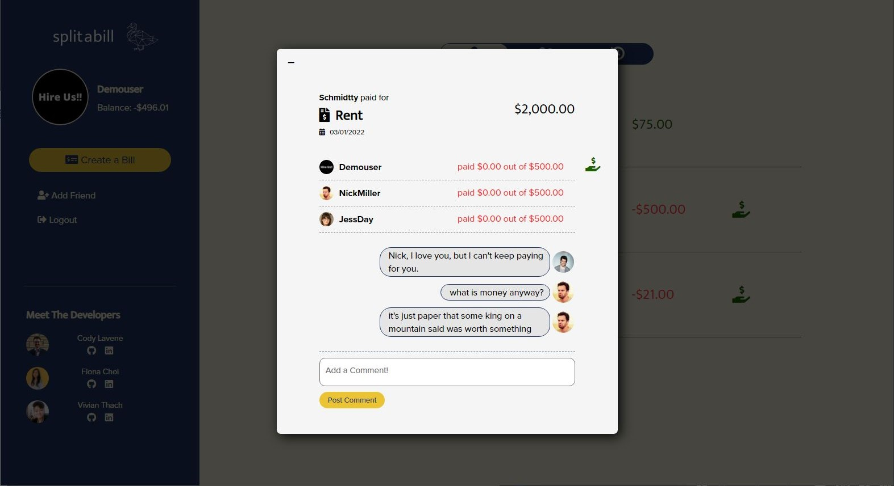
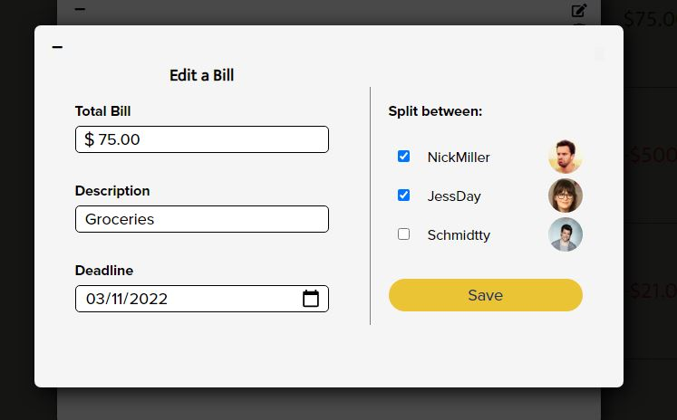
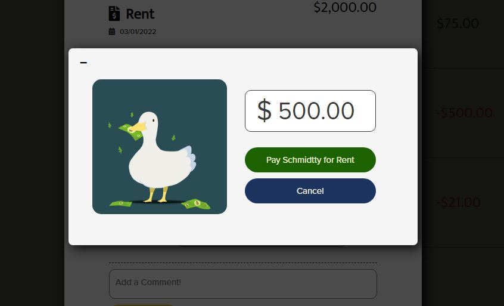
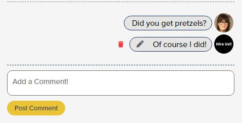
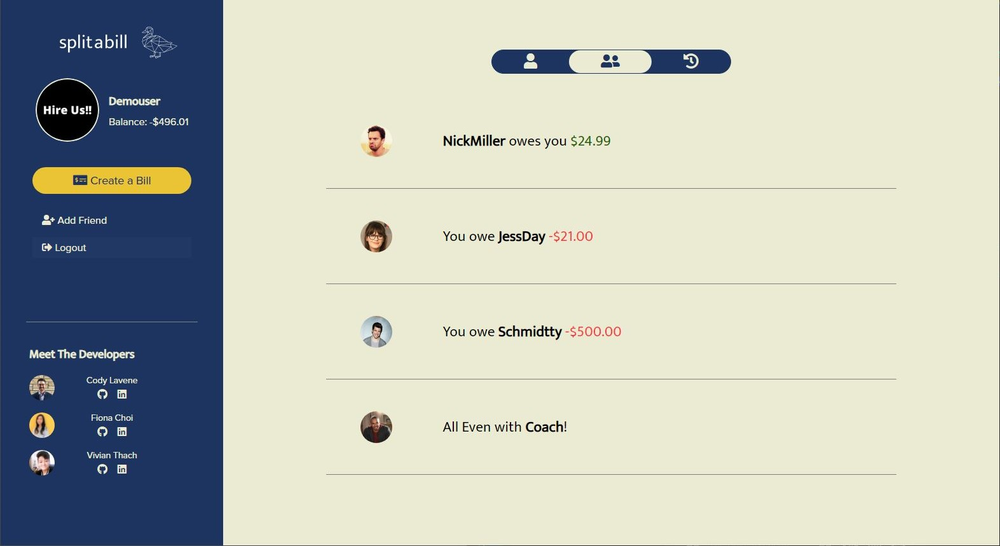
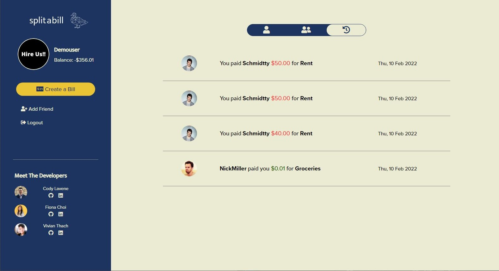
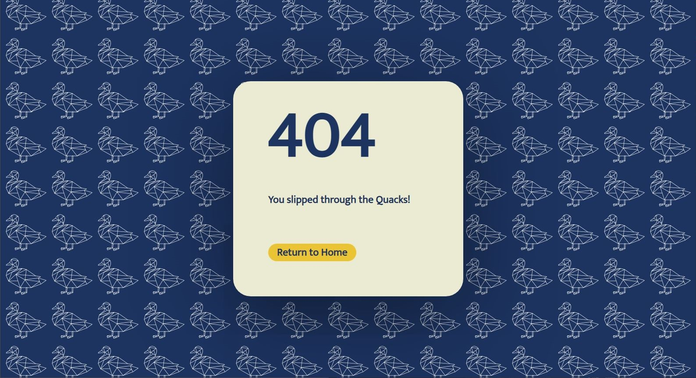

# SplitX

SplitX, inspired by the functionality of [Splitwise](https://www.splitwise.com) and the clean design of [Venmo](https://www.venmo.com), is an app where users can keep track of and pay bills/expenses shared between friends.

- [Live Site](https://splitx.herokuapp.com)
- [MVP Feature List]
- [Database Schema]
- [Frontend Routes]
- [API Documentation]
- [User Stories]

# Technologies Used


# Features

## Splash Page & User Authentication

Users can log into an existing account or sign up and create a new account. Alternatively, users can test the site with the Demo Login feature.




## User Dashboard

The logged in user's dashboard displays all the bills and expenses related to the user, as well as a side panel where the user can edit their profile picture, create a bill, add a friend, or log out.




## Bills & Expenses Tab

Clicking on a specific bill or expense will display a modal with the details for that bill or expense (people involved, how much each person still needs to pay for their individual expense, and comments made on the bill).



The user has the option to edit/delete bills they own, and pay back their expenses.






## Comments

The user can add comments on the bill detail modal, and edit/delete comments that they own.




## Friends Tab

Navigating to the friends tab will display a list of the user's friends and current balances. Clicking on a friend will display transaction records between the user and the friend.

The user can delete friends as long as all expenses between the user and the friend has been settled (balance is zero).




## Transaction History Tab

Navigating to the transaction history tab will display all the transactions the user has been involved in, with the most recent on top.




## Page Not Found

Trying to access a path that does not exist will render a 404 Page component.



# Editing a Bill Code Snippet
When editing a bill if a friend was removed from the bill, the associated expense also needed to be removed from the database.  Here we have a complex SQLAlchemy query to filter for the expenses to remove and update the corresponding balances between friends.
```
if len(all_friend_ids) > 0:
    expense_to_remove = Expense.query.filter(Expense.bill_id == bill.id, ~Expense.payer_id.in_(all_friend_ids)).all()
    for expense in expense_to_remove:
	if bill.owner_id != expense.payer_id:
	    friend1 = Friend.query.filter(Friend.user_id == bill.owner_id, Friend.friend_id == expense.payer_id).first()
	    friend2 = Friend.query.filter(Friend.user_id == expense.payer_id, Friend.friend_id == bill.owner_id).first()

	    friend1.balance -= Decimal(expense.initial_charge)
	    friend2.balance += Decimal(expense.initial_charge)
	    db.session.delete(expense)
	    db.session.commit()
```

# Database Schema


